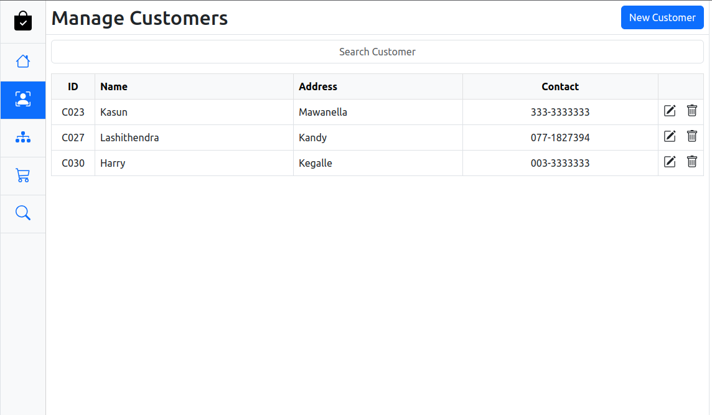

#Point of Sale (POS) System

This is a POS system created to manage customers, items, and orders. The backend is mainly based on the Spring framework, and MVC architecture is used.

### Front-End
* HTML5
* CSS3
* EcmaScript
  * Modules
* Bootstrap
* Animate.CSS
* CSS Loaders
* js-joda
* big.js
* AJAX
* Web API
  * DOM API
  * XHR
  * LocalStorage
  * WebSocket
  * Intl
* jQuery
  * jQuery AJAX

### Back-End
* Java 11
* Java SE 11
* Spring Framework (Spring Web MVC)
* Spring Web Socket
* Apache DBCP
* Lombok
* Jackson
* Client-Server Architecture
* Layerd Architecture
* Model Mapper
* JUnit
* Logback & Slf4j
* Hibernate Validator
* Spring JDBC

### Data-Base
* MySQL

